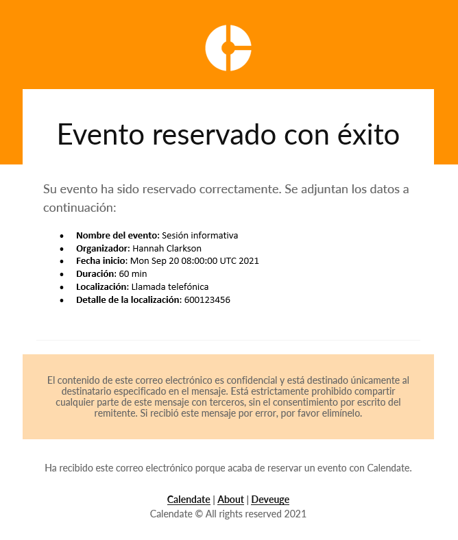
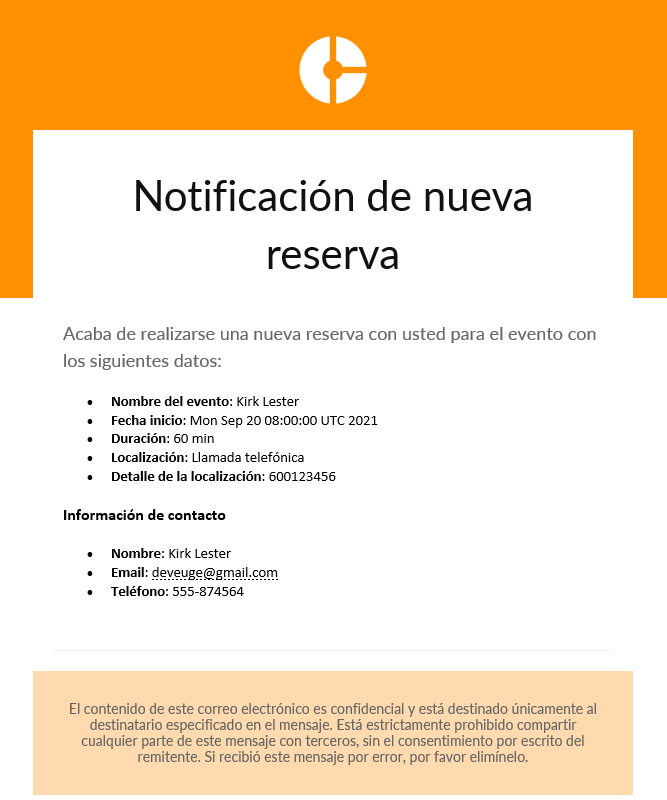
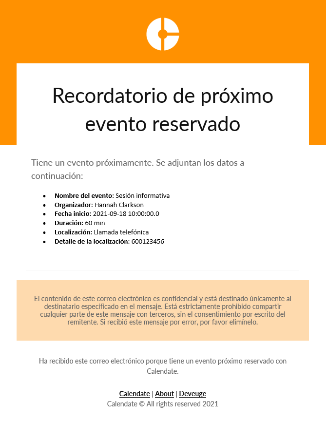

# Calendate (Work In Progress)
**Calendate** es una aplicación web basada en Spring Boot y Thymeleaf que facilita la gestión de eventos.

<a href="https://calen-date.herokuapp.com" target="_blank"></a>

> **Nota acerca de la previsualización:**<br/>
> <small>Tenga en cuenta que debido a que Heroku es una plataforma de aplicaciones en la nube gratuita, los tiempos de carga pueden ser algo elevados y no tienen nada que ver con la aplicación en sí.</small><br/>
><br/>
> Puede iniciar sesión con las siguientes credenciales:
> * Usuario: user
> * Contraseña: 12345678
>
> Los eventos creados por el usuario "user" pueden reservarse en el siguiente enlace:<br/>
> https://calen-date.herokuapp.com/user/{URLEvento}<br/>
> P.ej.: https://calen-date.herokuapp.com/user/info<br/>
><br/>
> Puede cambiar el idioma de la aplicación desde el menú de configuración.


## Características
- Los usuarios registrados podrán crear tipos de eventos que pueden reservarse con ellos especificando la siguiente información:
    - Nombre del evento
    - URL del enlace a generar para que los asistentes puedan realizar su reserva
    - Localización: ubicación física, llamada telefónica o llamada de Skype
    - Detalle de la localización: dirección física, número de teléfono o usuario de Skype
    - Descripción del evento
    - Color principal en el que se verá la página de reserva
    - Duración del evento en minutos
    - Fecha de inicio y fin entre las cuales puede reservarse el evento
    - Disponibilidad de horas por cada día de la semana en las cuales puede reservarse el evento
        - Si no se especifica hora de inicio ni fin se presupone que ese día no puede reservarse
        - Si no se especifica hora de inicio se presupone que el evento puede reservarse ese día desde las 00:00 hasta la hora de fin especificada.
        - Si no se especifica hora de fin se presupone que el evento puede reservarse ese día desde la hora de inicio especificada hasta las 23:59.
    - Configuración de notificaciones por correo electrónico. Se permite habilitar las siguientes opciones:
        - Envío de email de confirmación: envía un email de confirmación a los asistentes una vez el evento esté reservado.
        - Envío de email de notificación: emvía un email de recordatorio a los asistentes y al organizador una hora antes del evento.
- Se envían notificaciones por correo electrónico en dos supuestos:
    - La reserva de un nuevo evento:
        - Se enviará siempre un email al organizador para avisarle de los datos de una nueva reserva.
        - Si el evento tiene la opción de confirmación habilitada, se enviará también un correo de confirmación al usuario que realizó la reserva.
    - Un evento que está próximo a producirse:
        - Si el evento tiene la opción de recordatorio habilitada, se enviará un correo tanto al organizador como al asistente con la información del evento que está cerca de comenzar.
- Tanto los usuarios registrados como los no registrados pueden reservar un evento a través del path "/{username}/{url}" en el que podrán seleccionar el día y hora que prefieran dentro de la disponibilidad del organizador. Posteriormente, deberán dejar su nombre, email y teléfono de contacto para que el organizador pueda ponerse en contacto con ellos para el evento.
- Los usuarios registrados podrán visualizar fácilmente los eventos que tienen reservados a través del calendario disponible en la página principal.

## Aspectos técnicos
### Frontend
- Diseño responsive. No se emplean librerías adicionales al considerarse innecesarias en un diseño sencillo que puede lograrse con CSS flex y grid.
- Tema oscuro para los usuarios que así lo especifiquen en la configuración de su navegador. Se comprueba a través de la dierctriz:
 ```@media (prefers-color-scheme: dark)```
- Empleo de variables CSS, animaciones y transiciones para dar vida al diseño y hacerlo más profesional.
- Empleo de JS Vanilla para el comportamiento de alertas, menús, calendarios y formularios de múltiples páginas.

### Backend
- Uso de Spring Boot. Se parte desde un proyecto generado con [Spring Initializr](https://start.spring.io) con los siguientes módulos:
    - Spring Boot Web
    - Spring Boot Security
    - Spring Boot Mail
    - Spring Boot Data JPA + JDBC
    - Spring Boot Validation
    - Spring Boot Devtools
    - Spring Boot Thymeleaf
- Actualmente existe la posibilidad de inicio de sesión y registros de usuarios en los que todos actúan con el mismo rol "USER", que les permite crear eventos y ver los eventos reservados.
- Los usuarios anónimos pueden reservar un evento sin la necesidad de registrarse.
- La aplicación cuenta con la internacionalización de todos sus mensajes, haciendo posible visualizarla tanto en inglés como en castellano y pudiendo cada usuario configurar su lenguaje de preferencia.
- Para el envío de correos de recordatorio, se establece una tarea programada cada hora que consulta los eventos próximos a ocurrir en la próxima hora y se envía el email tanto al organizado como al asistente.
- El envío de correos está establecido dentro de un método asíncrono para no influir en el flujo normal de la página.
- Pese a que inicialmente la aplicación se pensó para utilizar MySQL como base de datos, con el despliegue en Heroku se necesitó el migrado a PostgreSQL.
- Actualmente no se hace distinción entre las diferentes zonas horarias, por lo que se usa UTC.

## Ejemplo de notificaciones por email


