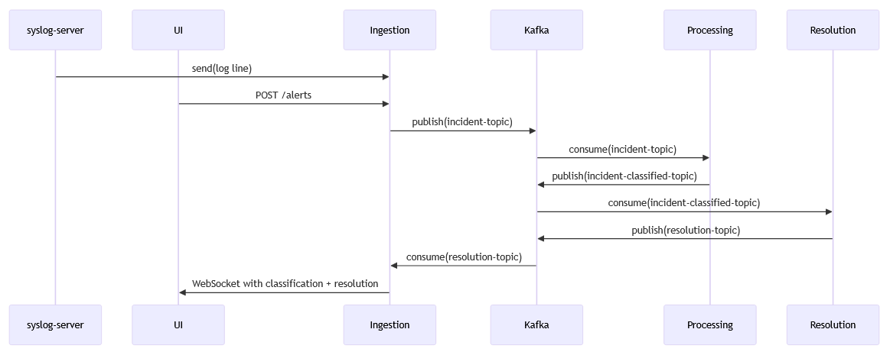

# SentinelAI

_AI-powered incident response system - Work in progress_

---

## 🧩 What It Does

**SentinelAI** is an AI-driven, event-based incident response platform built for IT operations and cybersecurity teams. It automates the full lifecycle of incident handling—from alert ingestion to resolution delivery—by leveraging natural language processing, semantic clustering, and generative AI. The system ingests real-time alerts from monitoring platforms or manual input, enriches and processes them using transformer-based embeddings, groups similar incidents via unsupervised clustering (e.g., KMeans), and classifies them by severity. Once an incident is processed, a tailored resolution is generated through AI text generation models and delivered asynchronously to the end user via WebSocket. All communication between microservices is managed through Apache Kafka, ensuring scalable, decoupled processing and real-time responsiveness.

## 🧠 Tech Stack

- Java 17: Core backend development language for all microservices.
- Spring Boot: REST API development, dependency injection, and WebSocket support.
- Hexagonal Architecture (DDD-light): Clear separation of concerns between infrastructure, domain, and application layers.
- Apache Kafka: Core messaging backbone enabling event-driven microservice communication.
- HuggingFace Transformers: Used for generating semantic embeddings of incident descriptions.
- KMeans Clustering: Unsupervised learning algorithm for grouping similar incidents.
- Spring AI: Integration layer for interacting with LLMs and AI models.
- OpenRouter API: External interface to generative models like DeepSeek for resolution suggestions.
- React (Vite + TypeScript): Frontend framework for building an interactive, real-time incident management UI.
- Docker & Kubernetes: Containerized deployment and orchestration for scalability and portability.
- WebSocket (STOMP over SockJS): Real-time communication channel between the backend and the frontend UI.
- ⚠️ PostgreSQL (planned): Persistent storage for incident history, learning feedback loops, and analytics.
- ⚠️ Prometheus & Grafana (planned): System metrics collection and visualization for observability.

## ⚙️ Communication Flow

SentinelAI is a distributed, AI-driven incident response system designed around a microservices architecture. The core communication model is built upon Apache Kafka, enabling event-driven, asynchronous processing across independent services. The system handles incoming alerts from both automated monitoring tools and manual user input, processes them using natural language models, and returns prioritized resolutions in real time.

### 1. Alert Ingestion

The communication flow begins with incident ingestion. This service provides a REST API endpoint (POST /alerts) that receives these incidents and is also capable of consuming structured logs directly from the internal syslog-server.

Once received, the alert data is validated, enriched with metadata if necessary, and then published to the Kafka topic incident-topic, which acts as the primary entry point for downstream processing.

### 2. AI-Powered Classification

The sentinel-processing microservice subscribes to incident-topic and is responsible for analyzing the alerts using AI models. It leverages NLP (Natural Language Processing) techniques—specifically sentence embedding models from HuggingFace Transformers—to extract semantic meaning from the incident descriptions. Using these embeddings, the system applies unsupervised clustering algorithms (such as KMeans) to group similar incidents together based on contextual similarity.

In addition to clustering, each incident is also classified by severity into one of four levels: Low, Medium, High, or Critical. Once enriched with this information, the incident is published as a AlertClassified to a second Kafka topic named incident-classified-topic.

### 3. Resolution Generation

Following classification, the sentinel-resolution microservice picks up messages from incident-classified-topic and uses generative AI models such as DeepSeek, accessed via OpenRouter, to generate structured, human-readable resolution recommendations.

Once a resolution is generated, it is published to a third Kafka topic called resolution-topic.

### 4. Resolution Delivery to the User

At this point, sentinel-ingestion takes on a second role as a consumer of resolution-topic. It pushes the resolution back to the user through real-time communication channels.

In production environments, this is achieved using a WebSocket connection (/ws/topic/alerts), allowing the frontend to receive live updates without polling.
