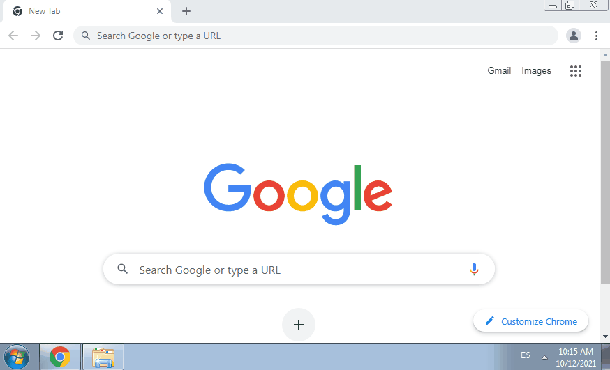
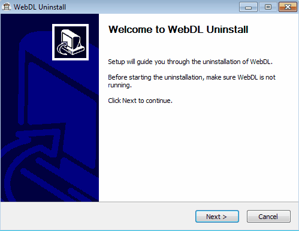

# WebDL
_Aplicación de escritorio Java con controlador de protocolo personalizado para la descarga de páginas web en diferentes formatos_

[](https://github.com/deveuge/webDL/raw/main/WebDL_1.0.0-SNAPSHOT.exe)


## Características
**WebDL** es una aplicación de escritorio Java creada para descargar páginas web en múltiples formatos a través de un controlador de protocolo personalizado:
* **HTML**: Descarga la página como un archivo de lenguaje de marcado de hipertexto.
* **PDF**: Descarga la página en formato PDF.
* **Imágenes**: Descarga todas las imágenes de una página web específica.
* **Captura de pantalla**: Toma una captura de pantalla de la página completa.
* **Video**: Descarga el primer video de una página web específica.
* **Markdown**: Descarga artículos de Wikipedia como archivos de Markdown. 

## Requisitos
* Sistema operativo: Windows
* Google Chrome: para las opciones de captura de pantalla, video y pdf.
* Conexión a Internet 

---

## Uso
### Instalación
Ejecute el instalador de WebDL y siga el asistente.
<details>
<summary>Mostrar proceso</summary>


</details>

### Ejecución
Llame a cualquier página web de su elección usando "webdl://" como protocolo y agregue uno de los siguientes tipos como parámetro de consulta con el nombre "type":
* HTML: descarga la página como HTML.
* PDF: descarga la página como PDF.
* IMG: descarga todas las imágenes de la página en una nueva carpeta.
* SS: toma una captura de pantalla PNG de página completa.
* VID: descarga el primer video de la página.
* MD: descarga artículos de Wikipedia como markdown. 

<details>
<summary>Mostrar proceso</summary>


</details>

### Ejemplos
| Tipo | URL original | URL WebDL |
|----------|-------------|------|
| HTML | https://en.wikipedia.org/wiki/The_Byrds | webdl://en.wikipedia.org/wiki/The_Byrds?type=HTML |
| PDF | https://en.wikipedia.org/wiki/The_Byrds | webdl://en.wikipedia.org/wiki/The_Byrds?type=PDF |
| Imágenes | https://en.wikipedia.org/wiki/The_Byrds | webdl://en.wikipedia.org/wiki/The_Byrds?type=IMG |
| Captura de pantalla | https://en.wikipedia.org/wiki/The_Byrds | webdl://en.wikipedia.org/wiki/The_Byrds?type=SS |
| Video | https://9gag.com/gag/a07mxVX | webdl://9gag.com/gag/a07mxVX?type=VID |
| Markdown | https://en.wikipedia.org/wiki/The_Byrds | webdl://en.wikipedia.org/wiki/The_Byrds?type=MD |

### Desinstalación
Ejecute el desinstalador de WebDL y siga el asistente.

<details>
<summary>Mostrar proceso</summary>


</details>

### Configuración
De forma predeterminada, las páginas web se guardarán en el directorio de descarga del usuario. Si desea cambiar esta ruta, puede hacerlo modificando el archivo de configuración "application.properties" ubicado dentro del directorio de instalación de WebDL.

El archivo contiene las siguientes propiedades de configuración: 
* **download.folder**: Carpeta donde se almacenarán las descargas de WebDL.

---
## Aspectos técnicos
WebDL utiliza las siguientes dependencias para realizar sus funciones: 
* [**jsoup**](https://jsoup.org): Analizador HTML de Java. Se utiliza para descargas de tipo HTML, MD, VID e IMG.
* [**Selenium**](https://www.selenium.dev): Proyecto de automatización de aplicaciones web. Se utiliza con el driver de Chrome para descargas de tipo SS, VID y PDF. 
* [**WebDriverManager**](https://github.com/bonigarcia/webdrivermanager): Librería Java que realiza la gestión de los drivers requeridos por Selenium WebDriver. Se utiliza para administrar la descarga del driver de Chrome. 
* [**Selenium Shutterbug**](https://github.com/assertthat/selenium-shutterbug): Biblioteca de utilidades de Java para realizar capturas de pantalla con Selenium WebDriver. Se usa para tomar una captura de pantalla de página completa en descargas de tipo SS.

El instalador se genera con un script personalizado escrito para [**NSIS**](https://nsis.sourceforge.io/Main_Page) que realiza las siguientes acciones:
* Registra el protocolo personalizado "webdl://" en el registro de Windows.
* Incorpora el JRE de 32 bits de Java 1.8 para evitar su instalación independiente y permitir que la aplicación funcione en todos los sistemas Windows, independientemente de su arquitectura.
* Crea el instalador y desinstalador con una interfaz de usuario visible usando [MUI2](https://nsis.sourceforge.io/Docs/Modern%20UI%202/Readme.html).

En caso de querer compilar el instalador, debe ejecutar el siguiente comando maven: 
```
mvn clean install -P installer -Dnsis.path=${NSIS_PATH} -Djre.path=${JRE_PATH}
```

Los registros de la aplicación se almacenan en una nueva carpeta llamada *".webdl"* dentro del directorio del usuario. 
